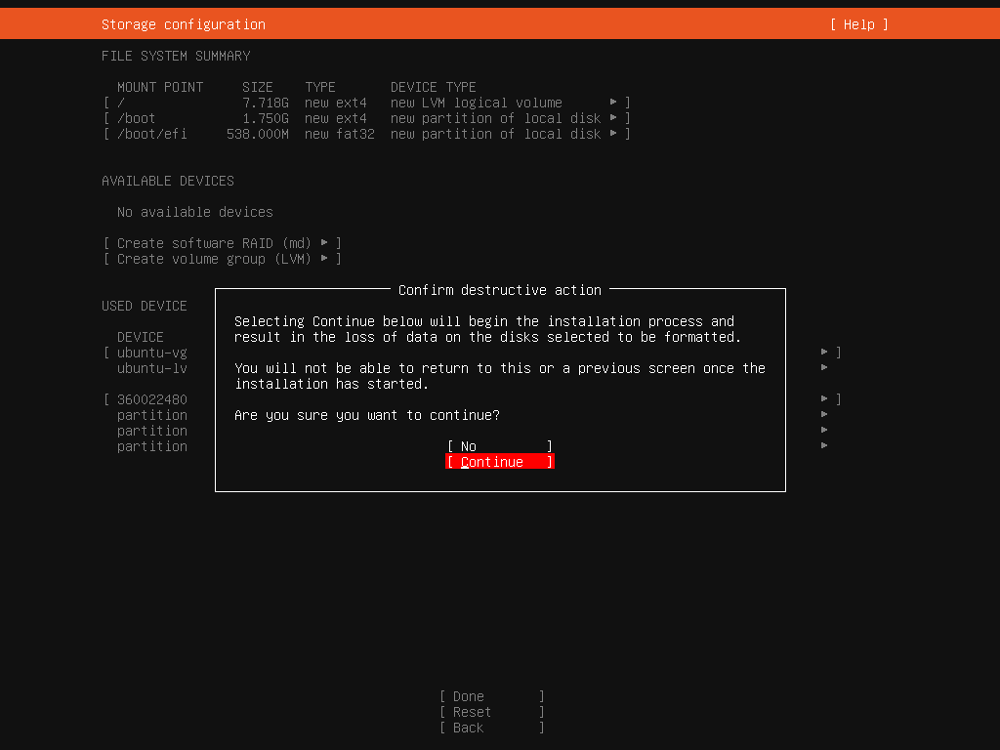

# 1. Hyper-V
Открываем cmd.exe от администратора.
```cmd
DISM /Online /Enable-Feature /All /FeatureName:Microsoft-Hyper-V
```
Перезагружаемся (y).

[Скачиваем установочное изображение Ubuntu Server](
https://releases.ubuntu.com/24.04.2/ubuntu-24.04.2-live-server-amd64.iso)

Добавляем виртуальную машину:


## Экран создания
1. Придумываем имя:


1. Gen 2:


1. Количество оперативной памяти (хотя бы 1024):


1. Выбираем свитч (Default Switch):


1. Указываем размер диска (хотя бы 5гб):


1. Выбираем скачанный образ Ubuntu Server


При желании можно создать External Switch, 
чтобы виртуальная машина получила постоянный адрес от роутера.


В настройках виртуальной машины убираем Secure Boot:


Также можно поменять, сколькими vCPU делиться с виртуальной машиной.

# 2. Установка VM
Нажимаем Enter:


Продолжаем менять Enter до этого экрана, 
здесь стрелочкой вверх выделяем поле для ввода текста 
и меняем https://*.archive... на https://archive...


Идем стрелочками вниз до Done -> Enter.

Соглашаемся на перезапись (пустого) диска:


Вводим:
- Полное имя пользователя
- hostname сервера
- Имя пользователя
- Пароль пользователя.


Обязательно ставим галочку "Install OpenSSH server" (с Space).
При желании можно зарегистрироваться на launchpad и загрузить туда публичную часть ssh-ключа.
Создать ssh-ключ в текущей папке (ed25519):
```cmd
ssh-keygen -t ed25519 -f .\id_ed25519 -C "" -N ""
``` 
Файл `id_ed25519` - приватная часть ключа,
`id_ed25519.pub` - публичная часть ключа.


Клавиша end, стрелочка вниз, пробел:


Ждём. По завершении установки перезагружаемся (выбираем Reboot Now стрелочкой вниз).

Появится сообщение об ошибке - не удалось отсоединить установочный образ. 
Нажимаем Enter, чтобы продолжить.

После перезагрузки, возможно, несколько раз необходимо нажать Enter, 
чтобы появился экран входа. Вводим имя пользователя и пароль.


# 3. Подключение по SSH, развертывание Tomcat и nginx
Прописываем команду `ip addr`, находим интерфейс eth0, записываем адрес сервера.


На хосте (на основной машине) открываем `cmd.exe` в той папке, 
в которой сгенерировали ssh-ключ.
В любой папке, если ключа нет.

В следующей команде заменяем 
NAME на имя пользователя, IPADDR на адрес сервера.

Если ключа нет:
```cmd
ssh NAME@IPADDR  
```
И вводим пароль.

Если ключ есть:
```cmd
ssh -i id_ed25519 NAME@IPADDR  
```

Команда спросит, добавить ли эту виртуальную машину 
в список известных. Соглашаемся: `y`.


Выходим с помощью `exit`.

В текущую папку, в которой открыт терминал, 
копируем .war файл и скрипт `deploy/ubuntu/deploy-tomcat.sh`.

Копируем их на сервер:
```cmd
scp -i id_ed25519 *.war *.sh NAME@IPADDR:~/
```
При этом заменяем NAME на имя пользователя,
IPADDR на адрес виртуальной машины. 
Убираем ` -i id_ed25519`, если нет ssh-ключа.

Стрелочкой вверх выбираем предыдущую команду, 
с которой входили в командную оболочку по ssh, входим.

Выставляем флаг, помечающий скрипт как исполняемый файл:
```shell
chmod +x *.sh 
```

Заходим в качестве root-пользователя (администратор):
```shell
sudo su
```
Вводим пароль, указанный при создании _нашего_ пользователя.

Запускаем скрипт:
```shell
./deploy-tomcat.sh
```


# 4. Файл hosts и проверка работоспособности
Открываем файл `C:\Windows\System32\drivers\etc\hosts` 
в текстовом редакторе, запущенном от администратора.

Добавляем в конец строчку:
```hosts
IPADDR example.com
```
Где IPADDR - IP виртуальной машины.


Сохраняем файл.

Далее либо перезапускаем браузер, либо запускаем другой. 
Проверяем, что работают:
- https://example.com/browse
- https://example.com/tomcat/browse


# Bonus

Добавлять файлы для просмотра можно, разместив их в папке 
`/opt/tomcat/webapps/ROOT/fileroot`.